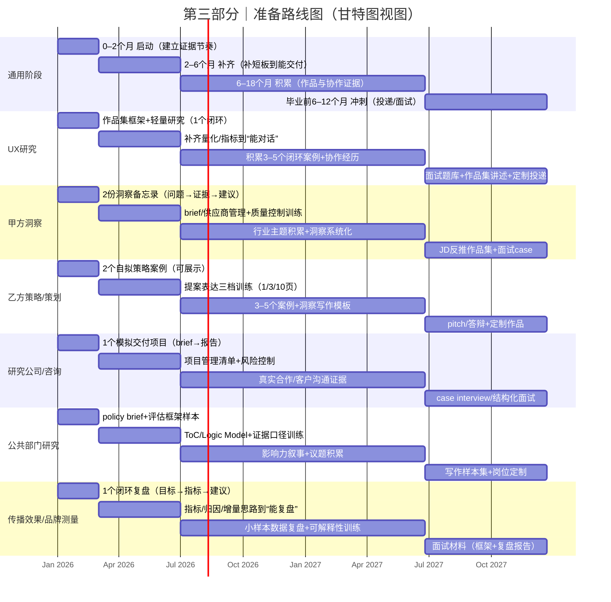

# 英国职业发展报告（纯文本版｜可直接编辑）

适用对象：传播 / 媒体 / 社会学背景，以**定性研究**为主的在读博士，目标在英国就业。  
目的：在不了解行业细节与岗位行话的前提下，先完成**职业路径初筛**，再用一套“行动验证路线图”逐步收敛到 1–2 条优先方向。

---

## 阅读方式（建议）

1. 先做 **第一部分：自我评估工具包**，获得“工作偏好画像”。  
2. 再看 **第二部分：六条职业路径评估**，对照画像做 1–2 条优先路径的初筛。  
3. 最后参考 **第三部分：准备路线图**，用小实验与作品证据验证假设（而不是把量表当作定论）。

---

## 重要说明（测评边界与反应偏差提示）

本工具为“**工作偏好 + 工作风格 + 价值取向 + 约束意识**”的混合型框架，用于职业路径初筛与行动路线图设计；**不等同于**经过严格心理测量学验证（结构、信度、效度、常模等）的职业测评量表。  
请将量表结果理解为“需要被后续证据验证的假设”，而非对个人能力或职业适配的最终结论。

为降低迎合性/社会赞许等反应偏差（例如“想把自己答得更好看”）：
- 作答请尽量基于**真实经历**（项目/作业/兼职/志愿/社团/研究协作）；
- 不存在“更好”的答案；若大量题目都选极高或极低，区分度会下降；
- 若某题“取决于情境”，可以选择中间分（3 分）。

---

# 第一部分｜自我评估工具包（不依赖岗位行话）

## 1.1 不需要先懂岗位：先做“工作偏好画像”

关键难点在于：在不了解行业与岗位细节时，类似“是否喜欢与 PM/设计一起迭代？”这类岗位化问题往往难以作答。  
因此，本节采用更朴实的方式：不问岗位行话，直接询问对任务类型、互动方式、节奏与压力、证据与表达的偏好。

### 作答方式
下面有 24 个陈述句，请按“像不像我”评分（1–5 分）：
- 1 = 完全不像我
- 2 = 不太像
- 3 = 说不清 / 看情境
- 4 = 比较像
- 5 = 非常像我

作答时可回想：过往项目/作业/社团/兼职里，哪些时刻最投入、最开心、最抗拒。

---

## 1.2 24题量表（8维度 × 每维3题）

> 计分规则：每题 1–5 分；同一维度三题求和（范围 3–15 分）。  
> 分数越高，表示对该类任务的偏好/胜任感越强（不代表“更好”，而是“更适合做哪类工作”）。

### 维度 A：结构化（把复杂问题拆清楚）
1. 面对模糊的问题，我倾向先把目标、范围、假设和约束写清楚。  
2. 我喜欢把一个大问题拆成可执行的步骤或小问题逐个推进。  
3. 我更愿意在开始前把关键定义与边界对齐，而不是边做边想。  

### 维度 B：深挖（对动机/机制有好奇心）
4. 我会不断追问“为什么会这样”，直到找到更底层的解释。  
5. 我愿意花时间理解人的动机、语境与差异，而不是只看表层行为。  
6. 我对“机制/逻辑链条”比对“结论本身”更敏感。  

### 维度 C：共创与协作（与他人一起把事情做成）
7. 我喜欢在讨论中逐步把想法磨出来，而不是独立完成后再交付。  
8. 我能在不同观点之间做整合，并推动团队形成可执行共识。  
9. 我愿意花时间做沟通与对齐，以减少后续返工。  

### 维度 D：表达与影响（把洞察变成行动）
10. 我擅长把复杂内容讲清楚，并让对方愿意据此做决定。  
11. 我喜欢把研究/分析写成“建议与取舍”，而不仅是“发现”。  
12. 我对“是否产生影响”很在意，会追踪结果并迭代表达方式。  

### 维度 E：证据与测量（愿意用数据/指标说话）
13. 我愿意学习指标、数据与基本统计概念来验证观点。  
14. 我更信任可复核的证据（数据、记录、对照），而不是直觉。  
15. 我喜欢复盘：哪些动作带来效果，哪些没有，原因是什么。  

### 维度 F：节奏与压力（在快节奏中交付）
16. 在时间紧、信息不完整的情况下，我仍能产出可用的版本。  
17. 我能在多任务并行中保持推进，而不是被细节拖住。  
18. 我可以接受方案被快速推翻或重做，并及时调整。  

### 维度 G：价值取向（公共性/公平/伦理）
19. 我对伦理、公平、弱势群体与公共利益议题更敏感。  
20. 我做决策时会考虑长期影响与外部性，而不仅是短期收益。  
21. 我愿意把工作对齐到社会价值/公共服务质量的提升。  

### 维度 H：商业与目标导向（对资源与结果负责）
22. 我会自然地关注资源约束（时间/预算/人力）并据此做取舍。  
23. 我愿意为结果负责，会把目标拆解成可衡量的里程碑。  
24. 我倾向把工作对齐到业务目标（增长/留存/口碑/效率等）。  

---

## 1.3 维度画像 → 职业路径（用于初筛的“假设映射”）

> 这是一张“更可能舒服/更容易做出成绩”的倾向性映射，不是门槛。

| 职业路径 | 更常见的高分维度（倾向） | 说明 |
|---|---|---|
| UX研究 | A/B/C/D +（E 中等） | 结构化问题定义 + 深挖机制 + 共创 + 将洞察变成产品决策 |
| 甲方洞察 | A/D/H +（E 中等） | 研究对接商业目标，强调建议、取舍与影响 |
| 乙方策略/策划 | B/D/F +（H 视岗位） | 洞察叙事与提案表达，快节奏与不确定性更强 |
| 研究公司/咨询 | A/F/D +（C 中等） | 项目制交付、质量与进度管理、客户沟通 |
| 政府/公共部门研究 | G/A/B/D | 价值取向、伦理与证据、写成政策简报与评估建议 |
| 传播效果/品牌测量 | E/H/A +（D 中等） | 指标与复盘闭环，把传播变成可衡量可优化的系统 |

---

## 1.4 决策矩阵（把“权衡”显性化）

建议对 2–4 条候选路径做打分（1–5 分）。  

| 维度 | 权重（1–3） | UX研究 | 甲方洞察 | 乙方策略/策划 | 研究公司/咨询 | 公共部门研究 | 传播效果/测量 |
|---|---:|---:|---:|---:|---:|---:|---:|
| 兴趣/投入感 |  |  |  |  |  |  |  |
| 能力迁移度（已有优势） |  |  |  |  |  |  |  |
| 学习成本（需要补齐的短板） |  |  |  |  |  |  |  |
| 进入门槛（作品/经验） |  |  |  |  |  |  |  |
| WLB/压力可承受度 |  |  |  |  |  |  |  |
| 市场机会/岗位数量 |  |  |  |  |  |  |  |
| 价值对齐（是否重要） |  |  |  |  |  |  |  |

> 解释：矩阵的价值在于“看清取舍”。不要追求满分，而要找最可持续的组合。

---

# 第二部分｜六条职业路径评估（英国市场）

本报告按六条主线组织：  
1) 用户体验研究（UX Research / User Research）  
2) 甲方洞察（Consumer/Customer/Market Insights）  
3) 乙方策略 / 创意策划（Strategy / Planning / Comms Planning）  
4) 研究公司 / 咨询（Research agency / Consultancy）  
5) 政府 / 公共部门研究（Policy / Evaluation / Public sector research）  
6) 传播效果与品牌测量（Brand/Comms Effectiveness / Measurement）

下文每条路径均按同一结构描述，便于横向对比：岗位内核、常见名称、主要工作、适配信号、能力树、进入方式、市场与薪资、优缺点与WLB、代表机构、验证型行动建议。

---

## 2.0 六条路径快速对比（总览表）

> 说明：为保证可编辑性，这里用纯文本表格做“岗位对比总览”。若觉得太宽，可以在 Word/Notion 中把本表转为更美观的表格样式。

| 路径 | 岗位内核（一句话） | 典型交付物 | 节奏/协作方式 | 量化/数据要求（相对） | 入门最关键证据 | 常见压力点 / WLB 风险 |
|---|---|---|---|---|---|---|
| UX研究 | 用研究证据影响产品决策 | 研究计划、访谈/可用性记录、洞察总结、设计建议、优先级 | 与产品/设计高频共创；迭代快 | 中（会加分；至少能与数据同事对话） | 3–5 个闭环案例（问题→方法→洞察→建议→影响） | 交付速度 vs 研究深度；stakeholder 管理 |
| 甲方洞察 | 把研究转成业务建议与取舍 | 洞察备忘录、策略建议、研究brief、复盘 | 跨部门翻译：研究→市场/产品/管理层 | 中（看行业；理解指标更稳） | 2–3 份“洞察→建议”的作品；能讲清业务目标 | 向上管理多；研究深度受业务节奏影响 |
| 乙方策略/策划 | 洞察→主张→策略→创意方向 | 一页主张、策略框架、提案/Pitch Deck 文案 | 项目制；对外沟通与提案多 | 低–中（看团队；偏叙事与说服） | 3–5 个策略案例（可自拟命题） | 提案期强度大；返工与不确定性 |
| 研究公司/咨询 | 对外交付研究与建议 | 报告、workshop 产出、客户沟通纪要 | 多客户多议题；流程与进度管理强 | 中（看公司；以可复核证据为底） | “研究交付能力”作品（方法+分析+报告结构） | 多项目并行；交付标准化与时限压力 |
| 公共部门研究 | 政策/项目评估：证据→建议 | policy brief、评估框架、证据综述、干系人访谈总结 | 伦理与可解释性重要；写作产出多 | 中（评估会用到；不必都做复杂模型） | 写作样本（政策简报/评估总结）+ 影响力叙事 | 程序性与合规要求；周期可能较长 |
| 传播效果/品牌测量 | 把传播变成可衡量可复盘的闭环 | 指标框架、活动后评估、复盘报告、优化建议 | 连接传播团队与数据/研究 | 高（指标与复盘能力是核心） | 1–2 份“目标→指标→数据→复盘→建议”闭环文档 | 数据口径对齐成本；解释性与归因争议 |

---

## 2.1 用户体验研究（UX Research / User Research）

### 岗位内核（一句话）
把“用户证据”转成可执行的产品决策，提升体验与业务指标。

### 岗位名称与变体（英国常见）
- User Researcher / UX Researcher
- Product Researcher / UX Insights
- Research Ops（研究运营/流程体系）
- Quantitative UX Researcher（偏量化）
- Mixed-Methods Researcher（混合方法）

### 具体做什么（典型工作流）
- 与 PM / Design / Analytics 对齐问题：要影响哪个决策？（功能、流程、信息架构、定价、激励机制等）
- 设计研究：定性（访谈、可用性测试、日记研究、情境观察）与/或量化（问卷、实验、日志分析）
- 招募与伦理：筛选目标用户、安排访谈、管理激励与数据合规（英国/欧盟语境尤需重视）
- 分析与洞察：编码 → 主题 → 机会点 → 结论置信度；把“用户语言”翻译成“产品语言”
- 落地：把洞察写进产品方案（PRD/Design rationale），推动优先级与路线图

### 细分行业与更适合该背景的高壁垒机遇
常见细分：消费互联网（电商、社交、内容）、B2B SaaS（企业工具/平台）、游戏与线上娱乐、金融科技、健康科技、教育科技、出行与本地生活。  
高壁垒机遇（更容易形成差异化）：
- 研究 Ops 与合规：在数据/招募/伦理流程上建立体系化能力，对大型组织较稀缺
- 复杂人群/敏感议题研究：儿童/家庭、弱势群体、健康与公共服务等（研究训练可迁移，但不必自限）
- 跨文化研究（UK + 中文市场/全球用户）：中英双语 + 跨文化访谈为加分项
- 游戏用户研究：将“体验”与“留存/付费/社群”结合（业务语境要求更高，但壁垒也更高）

### 岗位核心技能树与要求（从底层到进阶）
- 底层：研究设计（提问能力、偏差控制、样本策略）+ 定性方法深度（访谈/观察/共创）
- 产品语境：理解用户旅程、北极星指标、实验与迭代节奏；能写“可执行建议”而不止“洞察故事”
- 沟通：对齐利益相关者、管理分歧、讲清楚置信度与权衡
- 工具：Figma/原型、研究资料库（Dovetail/Notion/Airtable）、基础数据（Excel/SQL/GA/Amplitude 任一）
- 进阶：混合方法（问卷/统计/实验设计）或特定领域深耕（游戏、金融、医疗、AI 产品等）

### 发展前景（英国市场语境）
- 需求受产品周期影响：成熟产品更稳定；早期公司更看“全栈研究 + 落地能力”
- “会量化/实验”的研究员更稀缺；强定性也有空间，关键在把洞察转成决策与影响力
- 常见路径：Junior → Mid → Senior/Lead → Research Manager/Head of Research；亦可横向到 Product / Strategy

### 英国岗位数量与薪资（方向性参考，随公司/城市/资历波动）
- 岗位数量（相对）：中等偏多（伦敦最多；曼彻斯特、利兹、爱丁堡、布里斯托等也有）
- 波动性：中（受科技行业招聘周期影响）
- 薪资区间（£/年，常见 base，不含奖金/股权）：
  - 行业均值参考：约 £53k/年（Indeed UK，更新至 2025-12）
  - 广告/岗位口径均值参考：约 £77k/年（UX Gigs，基于 2025-12 至 2026-03 的公开岗位区间）
  - 伦敦早期参考：0–1 年约 £30k；1–4 年约 £44k（PayScale，伦敦）
  - 结论：区间差异大，主要取决于是否能影响产品决策、是否具备量化/实验能力、以及公司阶段

### 岗位数量与发展趋势（来自公开报告的摘要）
- 英国整体 vacancies：ONS 在《Vacancies and jobs in the UK: May 2026》中指出，**2026 年 2–4 月**全英 vacancies 约 **705,000**，并较前一季度与同比均出现下降（宏观层面会影响科技与产品团队的招聘节奏）。  
- 与该路径更相关的行业 vacancies（ONS VACS02，单位：千）：  
  - **Information & communication：39**  
  - **Professional scientific & technical activities：71**  
  这两个行业口径通常覆盖了较多互联网/软件与专业服务类岗位，因此可用作“总体热度”参考。  
- ONS 同期也指出 vacancies 下滑在小企业规模段更明显（例如 1–9 人规模段的下降更大），因此 UX 研究岗位在体感上更可能集中在**规模更大或产品更成熟**的组织里（含咨询/数字化团队）。  

### 岗位缺点 / 风险点
- “产品影响力”是硬门槛：若只做研究、不擅长推动决策落地，价值会被认为不清晰
- 招聘周期波动；面试通常包含研究方案、案例讲述、stakeholder 管理等综合考核
- 定性研究岗位也越来越要求对数据与指标有基本理解

### WLB（工作与生活平衡）常见情况
- 中等偏好：多数互联网/软件支持混合办公；节奏随版本发布与利益相关者而波动
- 峰值时段：版本发布前后、关键决策节点，可能出现集中加班与多会议

### 英国常见头部公司/机构（示例）
- Big Tech & Platforms：Google, Meta, Amazon, Microsoft, Apple（英国团队视具体业务）
- FinTech：Revolut, Monzo, Wise, Checkout.com（强度差异大）
- Consumer & Marketplaces：Deliveroo, Just Eat, Ocado, ASOS, Tesco tech, Kingfisher
- Games：King, Rockstar, Jagex, Frontier, PlayStation London Studio（岗位随项目周期）
- Agencies/Studios：Fjord/Accenture Song, Deloitte Digital, IDEO（研究/策略混合）

### 入门证据与“验证型行动”（建议）
- 作品集：3–5 个完整闭环（问题→方法→洞察→建议→影响/下一步），并能讲清“为何这样做/可信度如何”
- 小实验：选 1 个真实产品/服务做 5–8 访谈 + 主题分析 + 可执行建议 5 条；或做 1 次可用性测试（5人法）输出改进优先级
- 若走 Research Ops：补齐招募、同意书、激励、资料库与合规流程的“体系化产出”

---

## 2.2 甲方洞察（Consumer/Customer/Market Insights）

### 岗位内核（一句话）
用消费者/市场证据影响品牌与增长决策（定位、品类、传播、渠道、创新）。

### 岗位名称与变体（英国常见）
- Consumer Insights / Customer Insights Analyst/Manager
- Brand & Market Insights
- Audience Insights（媒体/内容行业常见）
- Category & Shopper Insights（零售/快消）
- Market Intelligence
- CX / Customer Research（与体验研究部分重叠）

### 具体做什么（典型工作流）
- 把业务问题翻译成研究问题：例如“为什么份额下滑？”“新包装是否会提升偏好？”
- 统筹研究：内部自研 + 外部供应商（研究公司/调研平台/媒体数据）
- 整合证据：定性洞察 + 销售/渠道/媒体数据，形成策略建议（而不是只交研究报告）
- 做“洞察产品化”：dashboard、insight library、定期洞察简报、决策节点评审材料
- 跨部门影响：Brand/Marketing、Product、Sales、E-commerce、Creative/Media agency 等

### 细分行业与更适合该背景的高壁垒机遇
常见细分：快消（FMCG）、美妆个护、食品饮料、酒类；零售与电商平台；媒体内容/流媒体/出版；汽车、出行、旅游与酒店。  
高壁垒机遇（更容易形成差异化）：
- 细分人群/文化语境洞察：跨文化、移民/多语种受众（中英双语可形成差异化）
- 传播内容洞察：把内容/叙事/媒介形式与品牌效果连接（传播研究可迁移）
- 创新与概念测试：共创工作坊 → 概念 → 测试 → 迭代，把抽象洞察落到可执行方案
- “洞察系统化”：洞察库、研究规范、供应商标准（偏战略运营能力）

### 岗位核心技能树与要求（从底层到进阶）
- 底层：消费者心理与行为框架（STP、JTBD、品牌资产/心智、品类结构）+ 定性研究能力
- 证据整合：把定性与业务数据、渠道/媒体数据结合成一套“可决策”的故事
- 供应商管理：brief、评标、质量把控、预算与时间线
- 沟通：用一页纸/5分钟讲清楚“结论–证据–建议–风险”，影响业务负责人
- 进阶：品类/渠道/定价/媒体归因等方向，或带团队做 insight strategy

### 发展前景（英国市场语境）
- 相对稳定：相比互联网产品研究，甲方洞察更贴近年度经营节奏（也会受行业景气影响）
- 成长路径：Analyst → Manager → Head of Insights/Strategy；或转品牌经理/战略/增长
- 关键要求：会做研究是入场券，核心在能否影响决策（商业表达 + 框架化）

### 英国岗位数量与薪资（方向性参考）
- 岗位数量（相对）：中等（伦敦最多；岗位分散且命名不统一：Insights/Intelligence/Strategy/Audience）
- 薪资区间（£/年，常见 base，不含奖金/股权）：
  - Consumer Insights Manager 英国均值参考：约 £50k/年（talent.com）
  - Insight Manager 英国均值参考：约 £47.5k/年（Indeed UK，更新至 2026-03）
  - Consumer Insights Manager 伦敦低位参考：约 £47.9k/年（Glassdoor，伦敦）
  - 提示：奖金、福利差异明显（养老金、年终、车补等），需看行业与公司

### 岗位数量与发展趋势（来自公开报告的摘要）
- 行业规模与就业：MRS 在 “Industry size and growth rates” 中估计，英国 research/insight/analytics 行业规模**接近 £9bn**，并估计至少 **70,000** 从业者、**4,000+** 家企业；这一口径覆盖了大量“洞察/研究/分析”相关岗位的供给侧生态。  
- 行业增长：MRS 于 2024-01 的新闻稿提到，Research Live Industry Report 2024 显示英国 top 100 研究机构在 2022 年出现明显增长、行业估值达到 £9bn（意味着洞察/研究相关岗位在英国具有较成熟的行业基础）。  
- 宏观冷热：在整体 vacancies 下降的周期中（ONS May 2026），甲方洞察岗位往往呈现“**相对稳定但更看重可证明的业务影响**”的趋势（更容易从 JD 看见“stakeholder 影响/商业框架化/决策支持”的要求）。  

### 岗位缺点 / 风险点
- 更依赖组织影响力：若公司决策文化不重视研究，洞察易被当作“参考”而非“驱动因素”
- 供应商管理与跨部门协调占比高，纯研究时间可能低于预期
- 晋升往往看“业务影响”而非研究深度

### WLB（工作与生活平衡）常见情况
- 通常较好：多为标准工时 + 混合办公；旺季集中在年度规划/大 campaign/新品上市前后
- 压力点：短时间内给出“可用结论”，并在多方利益中做取舍

### 英国常见头部公司/机构（示例）
- FMCG：Unilever, P&G, Diageo, Mondelez, Nestlé, Reckitt
- Beauty/Luxury：L'Oréal, Estée Lauder, LVMH（岗位视总部/地区组织）
- Retail/E-commerce：Tesco, Sainsbury’s, Marks & Spencer, Amazon Retail, Ocado
- Media/Content：BBC, Sky, Netflix（UK team）, Spotify（UK team）, Penguin Random House

### 入门证据与“验证型行动”（建议）
- 作品集形态：2–3 份“洞察备忘录/策略备忘录”（问题→证据→建议→风险与取舍），每份 3–5 页即可
- 小实验：选一个品牌/品类，用公开信息 + 3–5 次访谈做“人群–场景–障碍–机会”洞察，并给出可执行动作清单

---

## 2.3 乙方策略/创意策划（Strategy / Planning）

### 岗位内核（一句话）
把洞察转成“策略方向 + 创意原则 + 传播叙事”，以提案与落地为主要输出。

### 岗位名称与变体（英国常见）
- Brand Strategist / Strategy Planner / Creative Strategist
- Comms Planner（传播策划）/ Account Planner（客户策划）
- Social / Content Strategist（内容策略）
- Experience Strategist（体验策略，靠近 CX/服务设计）

### 具体做什么（典型工作流）
- 研究与洞察：桌面研究、社媒聆听、访谈/小样本定性、趋势分析
- 定义品牌问题：目标人群、场景、竞争、品牌资产、心智障碍
- 产出策略：定位、主张、关键讯息、创意方向、渠道策略、衡量指标
- 与创意团队共创：把策略翻译成可执行创意 brief，反复迭代提案
- 客户沟通与提案：讲故事、说服、答疑、竞标；也可能参与 campaign 复盘

### 细分行业与更适合该背景的高壁垒机遇
常见细分：品牌广告与传播（Integrated/Digital/Social）、内容营销与社媒、体验策略与服务设计、雇主品牌、公共传播（政府/NGO 项目也常外包给 agency）。  
高壁垒机遇（更容易形成差异化）：
- “研究 × 叙事 × 视觉/内容表达”一体化：媒体/影像背景有助于做出强作品集
- 跨文化/双语策略：服务中国市场、出海品牌、在英华人受众等细分项目
- 体验策略（Experience Strategy）：把品牌与体验（线下门店/线上服务）打通，进入更高单价项目
- 复杂议题传播：公共健康、可持续、教育等（属于可选优势方向）

### 岗位核心技能树与要求（从底层到进阶）
- 底层：洞察提炼（从混乱信息到一句洞察）+ 叙事与写作
- 策略框架：STP、品牌资产、创意策略、传播与渠道组合、效果衡量基本概念
- 提案能力：deck 结构、表达、现场应对与客户管理
- 作品集：3–5 个案例证明能从问题 → 洞察 → 策略 → 创意方向 → 结果/衡量
- 进阶：带项目/带客户；或向 Experience Strategy / Brand Consulting 发展

### 发展前景（英国市场语境）
- 入门更看“作品集 + 表达”，学历加分有限，但研究训练可转化为洞察优势
- 常见路径：Junior Planner → Planner → Senior → Strategy Director；也可转甲方洞察/品牌战略
- 行业波动性：中等偏高（受广告预算周期影响），但强能力者可在不同 agency 间流动

### 英国岗位数量与薪资（方向性参考）
- 岗位数量（相对）：中等（伦敦集中度高；北部城市也有但规模较小；岗位名称不统一）
- 薪资区间（£/年，常见 base）：
  - Brand Strategist 伦敦均值参考：约 £51.7k/年（Indeed London）
  - Brand Strategist 伦敦均值参考：约 £52.2k/年（Salary.com，London，2025-04）
  - 早期（1–4 年）参考：约 £30.3k/年（PayScale，UK）
  - 提示：Agency 薪资跨度大，“涨薪”常通过跳槽实现

### 岗位数量与发展趋势（来自公开报告的摘要）
- 行业口径参考：策划/策略岗位多分布在专业服务与信息传播相关行业。ONS VACS02（2026 年 2–4 月）显示 **Professional scientific & technical activities 为 71k vacancies**、**Information & communication 为 39k vacancies**（单位：千），可作为该类岗位总体热度的宏观参照。  
- 对“可证明有效”的要求上升：IPA 在《Making effectiveness work》（2024-10）相关发布中强调，在媒介与数据更碎片化的环境下，需要建立“学习文化”并将多种方法（模型、实验、模拟等）组合起来衡量有效性；这会让策略/策划岗位更常被要求具备**“洞察 + 表达 + 评估/复盘意识”**，而不只是创意口径。  

### 岗位缺点 / 风险点
- 提案与赶 deadline 会带来高峰期加班；节奏更不可控
- 对表达/包装要求高：要把洞察变成“说服力强的叙事”，不只是学术严谨
- 客户方向变化快，可能反复推翻与返工

### WLB（工作与生活平衡）常见情况
- 波动大：平时可能正常，但 pitch 期/大 campaign 期加班明显；取决于 agency 文化与客户类型
- 更适合：享受快节奏、喜欢表达与创意协作的人

### 英国常见头部公司/机构（示例）
- 广告集团：WPP（Ogilvy, VML, Grey 等）、Publicis（Saatchi & Saatchi 等）、Omnicom（BBDO 等）、IPG
- 独立/精品：Mother, BBH, R/GA, AKQA（UK team）, Wolff Olins（品牌咨询/设计）
- 体验与数字：Accenture Song, Deloitte Digital（策略/体验混合）

### 入门证据与“验证型行动”（建议）
- 作品集：3–5 个策略案例（可自拟命题），每个案例固定结构：命题/背景→洞察→主张→策略→创意方向→衡量
- 小实验：做 1 份“一页主张 + 三页策略框架 + 十页提案”三档版本练习，训练表达与取舍

---

## 2.4 研究公司/咨询（Research agency / Consultancy）

### 岗位内核（一句话）
以项目为单位交付“可被客户采用”的结论与建议：研究方法 + 项目管理 + 客户沟通三位一体。

### 岗位名称与变体（英国常见）
- Research Executive / Senior Research Executive
- Research Manager / Project Manager
- Consultant / Associate Consultant（研究/洞察/策略咨询）
- Strategy Consultant / Management Consultant（更偏商业分析）
- Behavioural / Social Researcher（社会研究方向）

### 具体做什么（典型工作流）
- 接到客户 brief：明确目的、受众、方法、交付与时间线
- 设计与执行研究：定性（访谈/焦点/共创）+ 量化（问卷/面板/数据），视团队而定
- 项目管理：招募、供应商、进度、质量与预算；多项目并行
- 分析与交付：报告、洞察、建议与呈现；往往要“可落地”与“可卖点化”
- 客户关系：定期对齐、汇报与后续机会挖掘（带一定咨询化销售能力）

### 细分行业与更适合该背景的高壁垒机遇
常见细分：综合市场研究（品牌健康度、U&A、概念测试）、零售与消费者面板（如 NIQ）、客户体验/满意度/神秘顾客、策略咨询（更偏商业问题拆解与模型）。  
高壁垒机遇（更容易形成差异化）：
- 定性研究专精 + 行业专精：医疗健康、公共服务、教育、金融等（更看重伦理与研究严谨）
- 混合方法（Qual+Quant）：能打通“探索 → 验证”的全链路，市场稀缺
- “研究到商业建议”的翻译能力：把研究洞察转换成客户可用的行动方案
- 语言与跨文化：多国项目/全球品牌项目的访谈与洞察整合

### 岗位核心技能树与要求（从底层到进阶）
- 底层：研究方法论（采样、偏差、问卷/访谈设计）+ 扎实写作与结构化表达
- 项目管理：多线程推进、风险控制、供应商协作
- 客户沟通：在会议里抓关键问题、守住研究边界、同时保持可交付
- 工具：PPT/故事化呈现、Excel；走量化/咨询线可能需要更强数据/模型
- 进阶：带团队、行业专家化、或转甲方洞察/品牌战略/更偏策略咨询

### 发展前景（英国市场语境）
- 市场研究公司常被视为“训练营”：快速补齐商业化表达、项目制交付与客户沟通
- 咨询公司（尤其策略）门槛更偏数理/案例面试；传播/定性背景可走“研究/洞察咨询、品牌与增长、体验策略”等支线
- 职业流动性强：Research firm → 甲方洞察很常见；亦可在 agency/咨询之间转换

### 英国岗位数量与薪资（方向性参考）
- 岗位数量（相对）：研究公司岗位相对稳定且持续；策略咨询竞争更激烈但回报更高；伦敦集中度高；研究公司在多城市有 office 且支持混合办公
- 薪资区间（£/年，常见 base）：
  - Ipsos：Research Assistant 约 £21.8k；Project Director 约 £66k（Glassdoor UK，2026）
  - Ipsos：Research Manager 约 £41.7k/年（Indeed UK）
  - 管理咨询入口：约 £40k–£50k/年（多家公开指南汇总，2025）
  - 提示：奖金结构差异大；策略咨询与精品公司通常更高

### 岗位数量与发展趋势（来自公开报告的摘要）
- 行业规模与就业：MRS “Industry size and growth rates” 给出的估计为：英国 research/insight/analytics 行业规模接近 **£9bn**，至少 **70,000** 从业者、**4,000+** 企业；这解释了为何研究公司/咨询在英国呈现“**岗位持续、公司分布广**”的行业形态。  
- 行业增长信号：MRS（2024-01）引用 Research Live Industry Report 2024 指出英国 top 100 研究机构在 2022 年增长显著、行业估值达到 £9bn，显示研究外包与证据服务在英国的产业链相对成熟。  
- 宏观冷热：在 ONS 指出的 vacancies 下行周期（May 2026）里，研究公司/咨询的招聘更可能呈现“**项目驱动**”：当客户预算收紧时，岗位更强调可快速交付与可卖点化（项目管理、客户沟通、结构化表达）。  

### 岗位缺点 / 风险点
- 项目并行压力大：高峰期加班常见，且需要频繁与客户沟通
- 容易“被交付驱动”：研究深度可能被时间线压缩
- 咨询路径对数理/案例思维要求高，需要投入准备（case interview 等）

### WLB（工作与生活平衡）常见情况
- 研究公司：中等（项目高峰期会紧）
- 咨询：波动大（由客户项目决定）
- 更适合：喜欢结构化交付、能在压力下推进多线程的人

### 英国常见头部公司/机构（示例）
- Market Research：Ipsos, Kantar, NielsenIQ, GfK（部分业务整合后以品牌线为主）, YouGov
- CX/Insight & Research：Forrester（研究与咨询）, Gartner（研究/咨询/销售结合）
- Consulting：McKinsey, BCG, Bain；Big4（Deloitte, PwC, EY, KPMG）；Accenture；精品（OC&C, Strategy& 等）

### 入门证据与“验证型行动”（建议）
- 用“研究交付能力”做 1 个模拟项目：brief→方法→样本→分析→报告（含限制说明与建议清单）
- 做 1 份“客户可用”的输出模板（目录、结论页结构、风险与限制、建议优先级），建立可复用框架

---

## 2.5 政府/公共部门研究（Policy / Evaluation / Public sector research）

### 岗位内核（一句话）
用研究证据支持公共政策与公共服务改进：把“问题–证据–建议–风险”写成可被采纳的决策材料。

### 岗位名称与变体（英国常见）
- Government Social Research Officer / Social Researcher
- Policy Researcher / Policy Analyst
- Evaluation Officer / Monitoring & Evaluation (M&E)
- Insight Analyst（公共部门语境）

### 具体做什么（典型工作流）
- 把政策/服务问题翻译成研究问题：需要理解谁？改变什么？衡量什么？
- 研究设计与伦理合规：招募、同意书、数据保护、敏感议题与弱势群体研究规范
- 执行研究：访谈/焦点小组/参与式工作坊/民族志观察；也可能与量化同事合作混合方法
- 分析与写作：形成政策简报（policy brief）、评估报告、建议清单与证据链（含限制说明）
- 跨部门协作：与政策、运营、供应商、地方政府/机构伙伴对齐，推动建议落地与复盘

### 细分行业与更适合该背景的高壁垒机遇
常见细分：英国政府部门与署（Civil Service / Government Social Research 体系）、地方政府与 Combined Authority（城市区域项目评估）、公共服务（NHS/公共健康、教育、社会服务）、第三部门（基金会/NGO 的项目评估与影响力研究）。  
高壁垒机遇（更容易形成差异化）：
- 高伦理与敏感议题研究能力：合规、数据保护与参与者保护做得好，是公共部门硬壁垒
- 参与式/共创（co-design）能力：把公众/服务对象引入方案设计与评估框架
- 从定性证据到决策材料的“翻译”：把复杂发现压缩成可执行的政策选项、利弊与风险

### 岗位核心技能树与要求（从底层到进阶）
- 底层：研究设计（偏差控制、采样、访谈/观察）+ 扎实写作（结构化、可审计证据）
- 政策与评估框架：Theory of Change / Logic Model；区分过程评估 vs 效果评估（impact）
- 利益相关者管理：在多方目标冲突下推进共识与交付
- 工具：Excel/基础可视化、合规文档、定性分析工具；进阶可补基础统计与问卷

### 发展前景（英国市场语境）
- 稳定性通常较好：更贴近公共服务长期需求（仍受财政周期与政策优先级影响）
- 成长路径清晰：Research Officer → Senior/Principal → Head of Profession/Programme；或转政策、战略与项目管理
- 对“写作口径”要求硬：强调可追溯证据、限制说明与可执行建议

### 英国岗位数量与薪资（方向性参考）
- 岗位数量（相对）：中等偏多（伦敦与各区域中心都有；不少岗位支持混合/跨城工作）
- 入口渠道：政府体系（GSR/fast stream）与社会研究机构/第三部门并行
- 薪资区间（£/年，常见 base）：
  - Social Researcher 常见区间：£30.4k–£49.7k（Glassdoor UK，25/75 分位，2025-10）
  - Government social research officer：入门 £25k–£30k；fast stream 起薪约 £31k；4–5 年可到 £45k–£55k（Prospects）
  - Evaluation Officer：估算中位约 £28.4k/年（Glassdoor UK，2025）

### 岗位数量与发展趋势（来自公开报告的摘要）
- 行业 vacancies 口径（宏观参照）：ONS VACS02（2026 年 2–4 月）显示 **Public admin & defence; compulsory social security 为 29k vacancies**（单位：千），可作为公共部门总体“职位空缺热度”的宏观参考。  
- 入口项目与名额规模：英国内阁办公室发布的《Civil Service Fast Stream: recruitment data 2025》显示，**Government Social Research Service 在 2025 年 Fast Stream 口径下 vacancies 为 16**（名额规模较小，竞争通常更强；但也意味着路径清晰、入口稳定）。  
- 趋势判断：公共部门研究更容易受财政周期与政策优先级影响岗位增减，但对“合规研究、评估框架与可执行写作口径”的需求较为长期化（因此对作品样本的要求更像“写作与证据链”而不是“提案型包装”）。  

### 岗位缺点 / 风险点
- 流程与合规要求高：伦理、数据保护与采购流程会增加“非研究时间”
- 决策周期更长：结论落地受政策与组织环境影响，成就感可能更延迟
- 写作与沟通要求硬：需要把复杂问题压缩成可行动材料

### WLB（工作与生活平衡）常见情况
- 通常较好且可预期；但在重大政策节点、拨款/评审与交付期会更忙
- 会议占比不低：需频繁与政策/项目/伙伴对齐，纯研究时间因岗位而异

### 英国常见头部公司/机构（示例）
- UK Civil Service（Government Social Research / 各部门分析与研究团队）
- NHS England / Public Health 相关机构与研究团队
- NatCen Social Research（英国社会研究机构）
- 地方政府 / Combined Authorities（城市区域分析与评估团队）
- Think tanks / 基金会（如 Nesta、Resolution Foundation、Institute for Fiscal Studies 等，视具体招聘）

### 入门证据与“验证型行动”（建议）
- 写作样本：1 份 policy brief（2–4 页）+ 1 份评估框架（逻辑模型 + 指标 + 数据来源 + 风险）
- 选一个公共议题做“证据→建议”练习：明确决策者、目标人群、可行政策选项与风险

---

## 2.6 传播效果与品牌测量（Brand/Comms Effectiveness / Measurement）

### 岗位内核（一句话）
把传播/品牌活动与效果指标连接：解释“发生了什么、为什么、下次怎么做”，让预算与创意更可决策。

### 岗位名称与变体（英国常见）
- Brand Effectiveness / Marketing Effectiveness
- Comms Measurement / Media Effectiveness
- Marketing Analytics（偏数据整合）
- Marketing Science（部分公司更偏量化）
- Econometrics / Marketing Mix Modelling (MMM)（更偏建模）

### 具体做什么（典型工作流）
- 定义目标与指标体系：品牌漏斗（Awareness/Consideration/Preference 等）、转化与增量（incrementality）
- 设计测量方案：品牌追踪（tracking）、前后测、对照/实验（A/B 或准实验）、渠道/创意拆解维度
- 整合证据：调研数据 + 平台/投放数据 + 业务数据，形成复盘与下一轮优化建议
- 把结果翻译成行动：人群、信息、创意、渠道组合、频次与预算分配建议

### 细分行业与更适合该背景的高壁垒机遇
常见细分：  
- 甲方：快消/零售/电商/娱乐内容/金融服务的品牌与增长团队  
- 乙方：媒体代理商、数据与效果评估公司、品牌咨询/研究公司（带 measurement 能力）  
- 平台方：广告平台/媒体平台的数据与效果团队（视具体业务）  
高壁垒机遇（更容易形成差异化）：
- “内容/传播机制解释”能力：用内容分析/叙事拆解，把创意要素与效果差异对应起来（传播背景可迁移）
- 能把洞察嵌入 brief：提前定义指标与测量，而不是活动结束后才复盘
- 跨文化传播与分群：中英双语在全球/出海/多元受众研究中可形成差异化

### 岗位核心技能树与要求（从底层到进阶）
- 底层：传播与品牌框架（漏斗、心智、触点）+ 基础指标体系（KPI/OKR 意识）
- 研究能力：定性解释 Why + 量化验证 What（至少理解实验/对照与基本统计概念）
- 数据整合：Excel/Sheets 熟练；进阶可补 SQL 与可视化（PowerBI/Tableau）
- 进阶分叉：Marketing Analytics（更数据）或 Econometrics/MMM（更建模，常用 R/Python）

### 发展前景（英国市场语境）
- 整体趋势向上：英国市场对“可衡量的传播效果”要求提高，预算更强调 ROI 与增量
- 成长路径：Analyst → Manager → Head of Effectiveness/Measurement；亦可转品牌洞察/增长/营销策略
- 个人竞争力关键：既能读懂数据，也能把结果讲成可行动的策略故事

### 英国岗位数量与薪资（方向性参考）
- 岗位数量（相对）：中等（大品牌、媒体代理商、研究公司/咨询、平台方均有；但名称分散）
- 技能门槛：比纯洞察更偏数据，但不一定一开始就要求高级建模
- 薪资区间（£/年，常见 base）：
  - Marketing Analyst 英国均值参考：约 £39.9k/年（Indeed UK，2026）
  - Marketing Analytics Manager 英国均值参考：约 £51.4k/年（Glassdoor UK，2026-01）
  - Marketing Analytics Manager 英格兰均值参考：约 £60.4k/年（Indeed England）
  - 提示：更偏 MMM/经济计量岗位通常更高，但也更硬核（JD 常明确 R/Python/统计）

### 岗位数量与发展趋势（来自公开报告的摘要）
- “需要把效果讲清楚”的趋势更强：IPA 在《Making effectiveness work》（2024-10）的发布中明确指出，在媒介与数据日益碎片化的背景下，没有单一“银弹”，多数广告主需要“拼接多种方法与数据源”来衡量有效性，并需要建立以证据与学习为核心的文化（MESI：Model–Experiment–Simulate–Implement）。这类行业共识会持续推动品牌测量/效果评估/营销分析岗位的需求。  
- 行业 vacancies 宏观参照（ONS VACS02，2026 年 2–4 月，单位：千）：  
  - Information & communication：39  
  - Professional scientific & technical activities：71  
  传播效果/测量岗位常分布在品牌方、代理商、研究公司与数据服务商，上述行业口径可作为“总盘热度”参考。  

### 岗位缺点 / 风险点
- 对量化与数据敏感度要求更高：至少能与数据同事对齐口径并理解方法限制
- 组织成熟度差异大：测量体系不完善时，容易出现“想测但测不到”的挫败感
- 产出易被追问：需要对方法与结论置信度负责（尤其归因/增量问题）

### WLB（工作与生活平衡）常见情况
- 中等偏好：相比咨询/agency 通常更可控；但 campaign 节奏与复盘周期会带来阶段性忙碌
- 忙点：大投放/大促/新品上市前后，或季度/年度复盘窗口

### 英国常见头部公司/机构（示例）
- 生态侧：大型媒体代理商、研究公司、以及提供 effectiveness 服务的咨询/数据公司（以 JD 为准）
- 甲方侧：大型 FMCG、零售、电商、金融与娱乐内容公司通常设有 effectiveness/measurement 岗位
- 公共信息参考：Indeed/Glassdoor 对 Marketing Analyst 与 Marketing Analytics Manager 有稳定样本，可用于谈薪基线

### 入门证据与“验证型行动”（建议）
- 输出 1–2 份“目标→指标→数据→复盘→建议”的闭环文档（可用公开数据/小样本调研）
- 做一次“创意要素拆解 + 效果差异解释”的练习：把传播内容分析能力与测量框架连接起来

---

# 第三部分｜准备路线图（按职业路径分类）

通用时间阶段（可按个人节奏拉长或压缩）：
- 0–2 个月：启动（确定候选路径、建立证据产出节奏）
- 2–6 个月：补齐（把关键短板补到“能对话/能交付”的水平）
- 6–18 个月：积累（持续产出作品与真实协作证据）
- 毕业前 6–12 个月：冲刺（面试题库、岗位投递、referral、谈薪）

下面每条路径给出差异化行动要点（尽量用“可验证产出”描述）。

## 3.0 路线图时间线（更易读版本）

为便于阅读，这里提供两种“时间线”表达（都为纯文本/Markdown，可编辑）：
- **A) Mermaid 甘特图**：在支持 Mermaid 的编辑器/平台（如 Notion/Obsidian/部分 Markdown 渲染器）会自动渲染为甘特图。
- **B) Markdown 总览表**：任何 Markdown 环境都可读。

### A) Mermaid 甘特图（起点可自行改为实际开始日期）

> 说明：把下方 `2026-01-01` 改成实际开始日期即可（格式 `YYYY-MM-DD`）。时长以“粗略月份”换算为天数展示。

### B) 总览表（每阶段的“关键产出”一眼看懂）

| 路径 | 0–2个月（启动） | 2–6个月（补齐） | 6–18个月（积累） | 毕业前6–12个月（冲刺） |
|---|---|---|---|---|
| UX研究 | 作品集框架 + 1个轻量研究闭环 | 指标/实验/量化到“能对话” + 汇报训练 | 3–5个闭环案例 + 真实协作/实习证据 | 作品集讲述 + 研究方案题 + 定制投递 |
| 甲方洞察 | 2份洞察备忘录（建议+取舍） | brief/供应商管理/质量控制 | 行业主题积累 + 洞察系统化（库/简报） | JD反推案例标题 + 面试case |
| 乙方策略/策划 | 2个自拟策略案例 | 提案表达三档训练（1/3/10页） | 3–5个案例 + 洞察写作模板 | pitch/答辩 + 定制作品 |
| 研究公司/咨询 | 1个模拟交付项目（brief→报告） | 项目管理清单 + 风险控制 | 真实客户/合作项目证据 | case interview + 结构化面试 |
| 公共部门研究 | policy brief + 评估框架样本 | ToC/Logic Model + 证据口径 | 影响力叙事 + 议题积累 | 写作样本集 + 岗位定制 |
| 传播效果/品牌测量 | 1个闭环复盘文档 | 指标/归因/增量思路到“能复盘” | 小样本数据复盘 + 可解释性训练 | 面试材料（框架+复盘报告） |

---

## A) UX研究 路线图

### 0–2个月（启动）
- 建 1 个作品集框架：每个案例固定结构（问题→方法→发现→建议→影响/下一步）
- 做 1 次轻量用户研究（5–8 访谈或 5 人可用性），形成完整交付物

### 2–6个月（补齐）
- 补齐基础量化/实验与指标概念到“能对话”（不要求成为数据岗）
- 练习研究汇报：10页以内让非研究同事看懂并愿意行动

### 6–18个月（积累）
- 累积到 3–5 个闭环案例（至少 1 个跨文化/双语情境）
- 争取 Research Assistant/实习/合作项目（哪怕是 Research Ops 方向）

### 毕业前6–12个月（冲刺）
- 面试准备：研究设计题、洞察题、stakeholder题、作品集讲述
- 针对目标公司/行业做定制化案例补强

---

## B) 甲方洞察 路线图

### 0–2个月
- 输出 2 份“洞察备忘录”（以业务问题为起点，给建议与取舍）

### 2–6个月
- 练习 brief 写作与供应商评估逻辑（方法选择、样本、质量控制）

### 6–18个月
- 建立“行业主题”积累（消费品/零售/媒体等择一主赛道）

### 毕业前6–12个月
- 用岗位 JD 反推作品集与案例标题；准备面试 case

---

## C) 乙方策略/策划 路线图

### 0–2个月
- 做 2 个自拟策略案例（命题→洞察→主张→策略→创意方向→衡量）

### 2–6个月
- 强化提案表达：一页纸主张、三页版策略框架、十页版提案

### 6–18个月
- 做到 3–5 个可展示案例，并建立个人“洞察写作模板”

### 毕业前6–12个月
- 针对目标 agency/行业做定制作品；练 pitch 与提案答辩

---

## D) 研究公司/咨询 路线图

### 0–2个月
- 用“研究交付能力”做 1 个模拟项目：从问题定义到报告交付

### 2–6个月
- 强化项目管理：时间线、风险点、质量检查清单

### 6–18个月
- 找真实客户/机构合作项目（哪怕小型），补齐客户沟通证据

### 毕业前6–12个月
- 训练咨询面试：结构化表达、案例拆解、优先级与取舍

---

## E) 政府/公共部门研究 路线图

### 0–2个月
- 将研究写成“政策简报 + 评估框架”（而非学术论文）

### 2–6个月
- 熟悉 UK 公共部门常用证据与评估语言（逻辑模型、ToC 等）并产出示例

### 6–18个月
- 积累公共议题的“影响力叙事”（为何重要、对谁重要、如何衡量改进）

### 毕业前6–12个月
- 准备写作样本（policy brief / evaluation summary），对齐岗位要求

---

## F) 传播效果与品牌测量 路线图

### 0–2个月
- 选 1 个品牌/活动，做“目标→指标→数据→复盘→建议”的闭环文档

### 2–6个月
- 补齐指标与数据语言到“能复盘”：品牌漏斗、归因/增量思路、实验意识

### 6–18个月
- 用自己的小样本数据做 1 次完整复盘（哪怕是公开数据/问卷/小规模访谈+指标）

### 毕业前6–12个月
- 准备面试材料：效果框架、复盘报告、如何把洞察反馈到策略优化

---

# 附录｜信息源提示（便于后续更新）

英国岗位与路径检索（建议从职位描述反推能力框架与作品集）：
- O*NET OnLine（兴趣类型与职业信息，适合做路径联想）：https://www.onetonline.org/
- 公司官网 Career 页面、LinkedIn Jobs、Glassdoor、Prospects 等

公开报告与数据（用于“岗位数量/趋势”的方向性参考）：
- ONS：Vacancies and jobs in the UK（最新）：https://www.ons.gov.uk/employmentandlabourmarket/peopleinwork/employmentandemployeetypes/bulletins/jobsandvacanciesintheuk/latest  
- ONS 数据集：VACS02 Vacancies by industry：https://www.ons.gov.uk/employmentandlabourmarket/peoplenotinwork/unemployment/datasets/vacanciesbyindustryvacs02  
- MRS：Industry size and growth rates：https://www.mrs.org.uk/resources/industry-size  
- MRS 新闻（Research Live Industry Report 2024 摘要）：https://www.mrs.org.uk/article/mrs/uk-research-sector-grows-by-1-billion-in-a-year-to-reach-record-9-billion-valuation-  
- UK Cabinet Office：Civil Service Fast Stream recruitment data 2025：https://www.gov.uk/government/publications/civil-service-fast-stream-recruitment-data-2025/civil-service-fast-stream-recruitment-data-2025-html  
- IPA（UK）：Making effectiveness work（发布解读与下载入口）：https://ipa.co.uk/news/making-effectiveness-work/  

（如需，我也可以把这份 MD 进一步拆成“可投递作品集版本”的章节结构，并生成一个更像咨询交付的目录与编号体系。）
